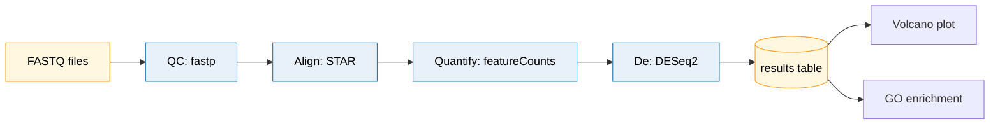
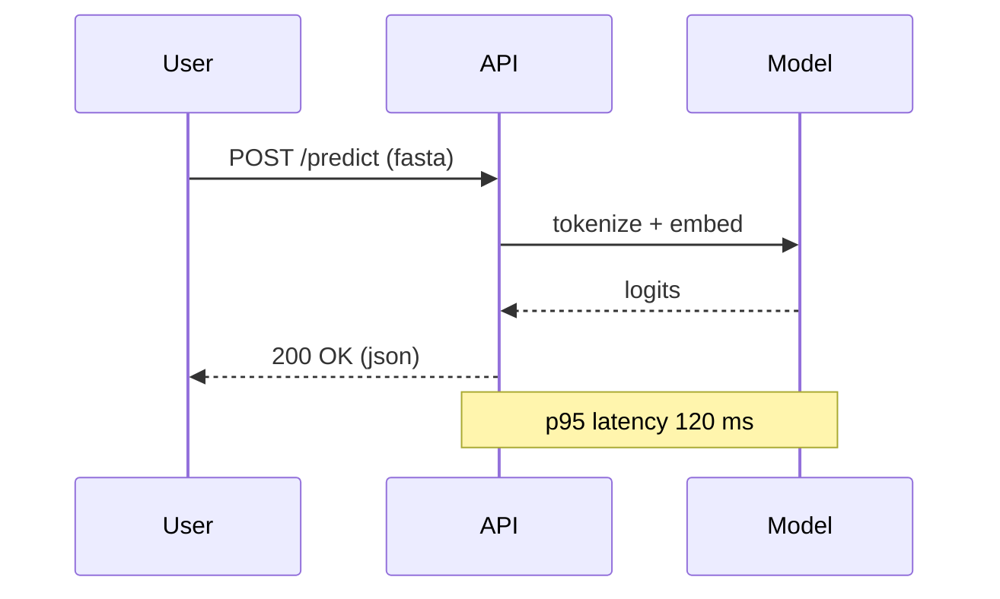

# Scientific Schematics and Diagrams

> This skill produces the non-data illustrative figures that anchor a manuscript: experimental workflows, study designs, model architectures, system diagrams, and conceptual schematics. It complements `ors-scientific-visualization-figure-design` (data plots) and `ors-scientific-visualization-color-and-accessibility` (palette audits). The cardinal rule is **one main idea per figure**; if the reader has to read the figure twice, split it.

## When to use

Trigger this skill when any of the following apply:

- A manuscript needs a graphical abstract, study-design cartoon, or workflow figure.
- You are describing a method (e.g., sample collection, library prep, model pipeline) that benefits from a visual.
- A reviewer or collaborator asks "could you draw this as a diagram?".
- You are producing a figure for a slide deck, poster, or thesis chapter where words alone are insufficient.
- You need an architecture figure for a computational pipeline (training/inference flow, data movement).

## When NOT to use

- Data plots (volcano, UMAP, survival curves) — use `ors-scientific-visualization-figure-design` or domain-specific `ors-bioinformatics-*` skills.
- Presentation slides themselves — use `ors-scientific-visualization-slides-design`.
- Large-format posters — use `ors-scientific-visualization-poster-design`.
- Pure typography/citations — use `ors-scientific-writing`.

## Prerequisites

- A single sentence that states the figure's main idea. If you cannot write this, the figure is not yet scoped.
- A list of the elements (boxes, arrows, panels) and the relationships between them. Drawing it on paper first usually pays off.
- For LaTeX/TikZ: a working TeX Live installation with `tikz` and a TikZ library set (e.g., `shapes.geometric`, `arrows.meta`, `positioning`).
- For SVG vector editing: Inkscape (free) or Affinity Designer / Adobe Illustrator.
- For declarative text-to-diagram: Mermaid CLI (`@mermaid-js/mermaid-cli`) or Graphviz (`dot`).

## Core workflow

1. **Write the one-sentence headline.** "This figure shows that X is converted to Y via three steps." Anything that does not serve that sentence is removed.
2. **Choose the tool family.** Declarative text-to-diagram (Mermaid, Graphviz, TikZ) for stable, code-reviewable figures; GUI vector editors (draw.io, Inkscape, Illustrator) for hand-tuned illustration; icon-heavy biomedical figures via BioRender or Inkscape + icon set.
3. **Sketch the layout on a 3×5 grid.** Decide on 1, 2, 3, or 4 zones; align every element to the grid. Diagonal lines are rare; use orthogonal arrows.
4. **Establish a visual vocabulary.** Pick a small set of shapes (rounded box = process, cylinder = data, diamond = decision, arrow = flow, brace = group) and stick to it.
5. **Color-code by category, not by decoration.** Limit to 3–5 hues (e.g., input, processing, output, control, error). Always pair color with shape or label.
6. **Label every element and every arrow.** Arrow text is an action verb ("normalize", "filter"), not a noun. Box text is a noun phrase.
7. **Set typography and stroke.** One sans-serif family, ~9 pt for print, 1 pt stroke for boxes, 0.75 pt for arrows. See the figure-design skill for rcParams.
8. **Export vector for print, PNG for previews.** PDF/SVG for journals; PNG at 300 DPI for slide decks; embedded in LaTeX via `\includegraphics`.
9. **Audit for accessibility.** Run a CVD simulator, check contrast, add alt text in the manuscript.
10. **Disclosure for AI-generated imagery.** If you use a generative tool to produce or enhance any portion, state the tool, prompt, and version in the figure caption or Methods, per the destination journal's policy.

## Code patterns

### A. Tool selection matrix

| Need | Recommended tool | Why |
|---|---|---|
| Quick editable vector diagram, free | **draw.io (app.diagrams.net)** | Free, desktop + web, exports SVG/PDF, large shape library, no install if you use the web app |
| Hand-tuned publication vector | **Inkscape** (or Affinity / Illustrator) | Full control, supports SVG natively, integrates with LaTeX via `inkscape --export-pdf` |
| Pipeline / sequence from text | **Mermaid** (`graph`, `flowchart`, `sequenceDiagram`, `erDiagram`) | Code-reviewable, version-controlled, renders in GitHub/Quarto, low learning curve |
| Auto-layout graph (trees, networks) | **Graphviz** (`dot`, `neato`, `fdp`) | Best automatic layout; great for phylogenies, dependencies, hierarchies |
| LaTeX-native vector with formulas | **TikZ / PGF** | Embedded in the manuscript, no external file, font consistency guaranteed |
| Biomedical icon-heavy illustration | **BioRender** (commercial) | Curated icon library for cells, tissues, organs; license required for publication |
| Schematic from generative AI | **DALL·E, Midjourney, Stable Diffusion** | Permitted by some journals with disclosure; check `ICMJE` and the destination journal's policy |

### B. Mermaid — workflow diagram (renders in Markdown)

````markdown

````

Render with `mmdc -i workflow.md -o workflow.pdf` or include in Quarto/LaTeX via a Mermaid filter.

### C. Mermaid — sequence diagram (e.g., for an API or training loop)

````markdown

````

### D. Graphviz — DOT for auto-layout (e.g., a method pipeline)

```dot
digraph pipeline {
    rankdir=LR; bgcolor="white";
    node [shape=box, style="rounded,filled", fontname="Helvetica", fontsize=10];
    edge [fontname="Helvetica", fontsize=9];

    fastq    [label="FASTQ",            fillcolor="#FFF7E0"];
    qc       [label="fastp",            fillcolor="#E8F1FA"];
    align    [label="STAR",             fillcolor="#E8F1FA"];
    quant    [label="featureCounts",    fillcolor="#E8F1FA"];
    de       [label="DESeq2",           fillcolor="#E8F1FA"];
    results  [label="DE table",         fillcolor="#FFF7E0", shape=cylinder];

    fastq  -> qc  [label="raw reads"];
    qc     -> align [label="clean reads"];
    align  -> quant [label="BAM"];
    quant  -> de   [label="counts matrix"];
    de     -> results [label="padj < 0.05"];
}
```



Compile with `dot -Tpdf pipeline.dot -o pipeline.pdf` or `-Tsvg` for web.

### E. TikZ — minimal figure skeleton in LaTeX

```latex
\begin{figure}[t]
\centering
\begin{tikzpicture}[
    node distance=12mm and 14mm,
    every node/.style={font=\sffamily\small},
    proc/.style={rectangle, rounded corners=2pt, draw=black!70,
                 fill=blue!10, minimum width=22mm, minimum height=8mm,
                 align=center, line width=0.5pt},
    data/.style={cylinder, shape border rotate=90, draw=black!70,
                 fill=orange!15, aspect=0.3, minimum height=8mm, align=center},
    arr/.style={-{Latex[length=2mm]}, line width=0.5pt}
]
\node[proc] (qc)  {fastp};
\node[proc, right=of qc] (aln) {STAR};
\node[proc, right=of aln] (cnt) {featureCounts};
\node[data, above=of qc]  (fq)  {FASTQ};
\node[data, right=of cnt] (res) {DE table};

\draw[arr] (fq) -- (qc);
\draw[arr] (qc) -- node[above, font=\scriptsize]{clean} (aln);
\draw[arr] (aln) -- (cnt);
\draw[arr] (cnt) -- node[above, font=\scriptsize]{counts} (res);
\end{tikzpicture}
\caption{Schematic of the RNA-seq quantification and differential-expression
workflow. Cylinders denote data artifacts; rounded boxes denote processes.}
\label{fig:workflow}
\end{figure}
```

### F. draw.io export (command line)

```bash
# Convert a draw.io file to a clean PDF with embedded fonts
drawio --export --format pdf \
       --border 10 \
       --scale 2 \
       --embed-svg-images \
       workflow.drawio
# or via the headless CLI
drawio --headless --export workflow.drawio --output workflow.pdf
```

### G. Inkscape — vector cleanup for camera-ready

- Save the working file as `.svg`. Export a PDF with `File → Save As → PDF` for the journal.
- Convert all text to paths only if the journal explicitly requires it; otherwise keep live text so it is searchable and accessible.
- Use `Extensions → Color → Randomize` only to find duplicates you missed; never on the final figure.

## Visual grammar (the recurring vocabulary)

| Element | Shape / style | Use for |
|---|---|---|
| Process / step | Rounded rectangle | An action, a tool, a transformation |
| Data / artifact | Cylinder or folder | A file, a table, a database, a model checkpoint |
| Decision | Diamond | A yes/no branch, a threshold check |
| External system | Cloud or dashed box | A service, an external database |
| Group / region | Lightly tinted background panel | A module, a stage, a phase |
| Flow | Arrow with verb label | Movement, dependency, causality |
| Inhibition | Blunt-end arrow (`-|-`) | Negative regulation, knock-out |
| Activation | Standard arrow (`->`) | Positive regulation, activation |
| Bidirectional | Double arrow (`<->`) | Communication, two-way binding |

Pick one shape per category, do not switch. Use the same color for "input", the same color for "processing", the same color for "output" across every figure in the manuscript.

## Layout principles

- **One column at a time, top to bottom, or one row, left to right.** Readers in science journals read in a Western L→R top→bottom pattern. Multi-column flows need explicit numbering.
- **Group by proximity.** Place elements that belong together in a tinted background or with a brace.
- **Number complex flows.** When the figure has more than 5 steps, label each step (1, 2, 3, ...) and refer to the numbers in the caption.
- **Reserve whitespace.** A figure that fills the whole canvas looks crowded. Use 10–15% margin on every side.
- **Cap at 4 zones.** More than 4 quadrants/regions and the reader's working memory breaks. Split into two figures.
- **Use a scale reference where appropriate.** For geographic/size schematics (organ, organism, chip), include a scale bar in real units.

## Accessibility for diagrams

Diagrams have unique accessibility needs beyond plots:

- **Alt text.** Write 1–3 sentences that name the figure type, the main idea, and the key elements. Example: "Workflow diagram. FASTQ files are QC-filtered with fastp, aligned with STAR, quantified with featureCounts, and tested for differential expression with DESeq2."
- **Color + shape.** Every category gets both a color and a unique shape, so CVD readers can still distinguish them.
- **Text contrast.** All labels must meet WCAG 2.1 AA (4.5:1 for normal text, 3:1 for large). Test with the WebAIM contrast checker.
- **No information conveyed by color alone.** If two branches are different, use different line styles as well.
- **Readable at print size.** If a label is illegible at the journal's column width after PDF export, increase font size; do not shrink the figure.
- **No emoji, no clip-art, no decorative icons** in figures destined for a journal article.

## Journal conventions

| Journal / publisher | Schematic conventions |
|---|---|
| **Nature** | Vector PDF or SVG preferred; panel labels lowercase bold (a, b, c); figure caption begins with a one-sentence summary |
| **Cell** | Strict vector requirement; Arial/Helvetica 6–8 pt after reduction; no gradients; specific color guidance in author instructions |
| **PNAS** | Width 8.7 cm or 12.1 cm; sans-serif; bold uppercase panel labels (A, B); tagging recommended for "boxed" callouts |
| **PLOS** | RGB or CMYK; 300+ DPI raster, vector preferred; alt text required in submission system |
| **IEEE** | 3.5" or 7.16" wide; sans-serif 8–10 pt at final size |
| **eLife** | 110 mm or 225 mm; vector preferred; alt text enforced |

Always check the destination journal's "Information for Authors" before export.

## AI image generation: a disclosure note

Generative tools (DALL·E, Midjourney, Stable Diffusion, Ideogram, Flux) can produce plausible scientific schematics but routinely:

- Hallucinate anatomical structures (extra organelles, wrong cell-type morphology).
- Mis-label molecules, arrows, and reagents.
- Inherit the style of copyrighted training images (BioRender-style iconography is a common example).
- Produce text in illegible or fabricated fonts.

If you do use a generative tool, the recommended practice is to treat the output as a sketch and redraw it in Inkscape or Illustrator for clarity, accuracy, and accessibility. Many journals (Nature, Science, Cell, JAMA) require explicit disclosure of generative-AI use in figures, including the model name, version, prompt, and any human modifications. Check the destination journal's policy; when in doubt, disclose.

## Common pitfalls

- **Decoration over information**: gradients, shadows, 3D bevels. They add ink without adding signal. Use flat fills.
- **Color-only encoding**: red vs. green to distinguish two groups. ~8% of male readers see no difference. Use shape + color.
- **Arrow spaghetti**: arrows crossing everywhere. Re-route around elements; use a slight vertical offset for parallel arrows.
- **Unreadable labels at print size**: 6 pt body text after the journal reduces to 80%. Set the test page at the final print size before exporting.
- **Mixing units**: some boxes in pixels, some in mm. Pick one. For SVG, set the document size in mm and use viewBox; for TikZ, use mm throughout.
- **Forgetting the data type**: a rounded box where a cylinder belongs (e.g., a "results table" drawn as a process). Readers parse shape semantically.
- **Reusing a BioRender figure without a license**: BioRender content is licensed for use only by the original author for a specific paper. Re-using or adapting it for another paper requires a new license.
- **Embedded raster in a "vector" file**: a 72 DPI PNG dragged into Inkscape and exported as PDF looks fine on screen and is blurry in print. Always import at ≥ 300 DPI.

## Validation

- **Squint test**: squint at the figure. The one main idea should still be readable as a silhouette.
- **Five-second test**: show the figure to a colleague for 5 seconds, then hide it. Ask them to state the main idea. If they cannot, simplify.
- **Greyscale test**: convert the figure to greyscale (`gs -sDEVICE=pngalpha -sColorConversionStrategy=Gray ...`) and confirm the figure still tells its story.
- **CVD test**: pass the exported PNG through Coblis or Sim Daltonism (deuteranopia, protanopia, tritanopia). All elements should remain distinguishable.
- **Print test**: print at the final size on paper. If a label is unreadable from 2 feet, the figure is not publication-ready.
- **Alt-text test**: paste the figure (no caption) into a doc, share with a colleague who has not seen it, and read them your alt text. If the colleague can sketch the figure from the alt text alone, the alt text is doing its job.

## Open alternatives

| Commercial / proprietary | Open alternative | Trade-off |
|---|---|---|
| BioRender | Inkscape + sci-domain icon set (e.g., `scikit-image` glyphs, `reactome.org` icons, or `Servier Medical Art` for CC-BY icons) | Free; smaller icon library; requires manual placement |
| Adobe Illustrator | Inkscape | Same vector file format (SVG), slightly different UX; no cloud-only features |
| Lucidchart / Miro | draw.io (app.diagrams.net) | Free, self-hostable, exports to SVG/PDF, large community shape library |
| yEd (yWorks) | Graphviz / Mermaid | Free; less interactive, but code-driven and version-controllable |
| Microsoft Visio | draw.io | Free, sufficient for most scientific diagrams; no native database reverse-engineering |
| OmniGraffle | Inkscape | macOS-only commercial; Inkscape is cross-platform and free |
| Photoshop pixel-pushing | Inkscape + GIMP (raster) | Free; GIMP for image cleanup, Inkscape for vector layout |
| Generative AI tools (DALL·E, Midjourney) | Hand-draw in Inkscape | Reliable, accessible, disclosable; slower; better for accuracy |

## References

Internal cross-links to other `ors-*` skills:

- `ors-scientific-visualization-figure-design` — DPI, vector/raster, rcParams, multi-panel layout.
- `ors-scientific-visualization-color-and-accessibility` — palette choice and CVD audit.
- `ors-scientific-visualization-slides-design` — adaptation for projection (larger fonts, fewer elements).
- `ors-scientific-visualization-poster-design` — adaptation for A0/letter print.
- `ors-scientific-writing` — caption-writing guidance and alt-text conventions.

External resources (do not fabricate exact paths):

- draw.io / diagrams.net documentation — `www.diagrams.net`
- Inkscape official documentation — `inkscape.org/doc`
- Mermaid documentation and live editor — `mermaid.js.org`
- Graphviz documentation and gallery — `graphviz.org/documentation`
- TikZ / PGF manual (included with TeX Live; `texdoc tikz`)
- BioRender publication-licensing terms — `biorender.com`
- Servier Medical Art (CC-BY biomedical icon library) — `smart.servier.com`
- WCAG 2.1 contrast guidelines — `w3.org/TR/WCAG21/`
- Nature / Cell / PNAS / PLOS figure guidelines (journal-specific author instructions)

## Changelog

- 1.0.0 (2026-06-10): Initial adaptation by Pradyumna Jayaram from `scientific-schematics` (K-Dense Inc.). Consolidated the AI-image-generation workflow into a disclosure note, added Mermaid + Graphviz + TikZ declarative patterns, added journal-specific schematic conventions and an accessibility checklist.
